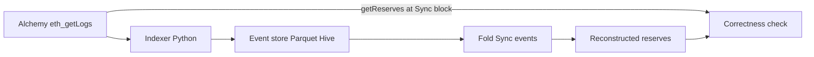

# lp-history-reconstructor

Reconstruct Uniswap V2 pool history from on-chain events (**event sourcing**),
then prove correctness by comparing reconstructed reserves against
`getReserves()` at control blocks.



## What this demonstrates

- **Event sourcing for DeFi state**: pool reserves at any block = fold of ordered `Sync` events
- **Chunked `eth_getLogs` backfill** with checkpoints (resume-safe, rate-limit friendly)
- **Measurable data quality**: reconstructed `(reserve0, reserve1)` must match on-chain exactly
- **Config-driven pools**: add a pool address in `config/pools.yaml`, no code change

Phase 1 scopes a recent block window (`lookback_blocks`) so the pipeline is
demoable on Alchemy's free tier. **Free-tier Alchemy caps `eth_getLogs` at a
10-block range**, so `chunk_size` defaults to 10. Raising the lookback (or moving
to PAYG) is a config change — checkpoints make resume safe.

## Quickstart

```bash
# 1. install
uv sync

# 2. configure Alchemy (Ethereum Mainnet HTTPS URL)
cp .env.example .env
# edit .env → LP_ETH_RPC_URL=https://eth-mainnet.g.alchemy.com/v2/<KEY>

# 3. backfill + verify
make backfill
```

No paid APIs beyond Alchemy's free tier.

## Default pool

Uniswap V2 **WETH/USDC** — `0xB4e16d0168e52d35CaCD2c6185b44281Ec28C9Dc`
(token0=USDC 6dp, token1=WETH 18dp).

## Repository layout

```
config/          pools + pipeline params (YAML, validated by pydantic)
schemas/         raw event contract
src/lp_history/
  rpc/           JSON-RPC client (retries + backoff)
  index/         V2 ABI decode + chunked backfill
  load/          Parquet event store + checkpoints
  state/         fold Sync → reserves
  verify/        getReserves() comparison
tests/           fixtures + mocked RPC
```

## Development

```bash
make lint
make test
```

## Roadmap (later phases)

- Full backfill from pool deployment block
- Dagster partitioned backfill job
- Live tail via `eth_subscribe`
- dbt metrics (TVL, fees, impermanent loss, LP PnL) + dashboard
- ClickHouse + docker-compose on a cheap VM
