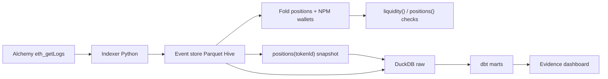

# lp-history-reconstructor

Reconstruct Uniswap **V3** (and V2) pool history from on-chain events
(**event sourcing**), attribute positions to wallets via NPM, then measure
**fees / IL vs HODL by range width** in dbt.

**Dashboard:** Evidence.dev under `dashboard/` — deploy to Vercel with Root Directory
`dashboard` (same pattern as [crypto-market-elt](https://github.com/marioespinosaperales/crypto-market-elt)).
See `dashboard/README.md`.



## What this demonstrates

- **V3 concentrated liquidity**: positions keyed by `(owner, tickLower, tickUpper)` with **range width**
- **NPM wallet attribution**: `tokenId → wallet` via ERC-721 `Transfer`, verified with `positions(tokenId)`
- **Event sourcing**: net liquidity = fold of ordered `Mint`/`Burn` (pool) and `Increase`/`DecreaseLiquidity` (NPM)
- **Measurable data quality**: pool `liquidity()` vs in-range fold; NPM liquidity vs `positions(tokenId)`
- **Fees + IL vs HODL by range width**: dbt marts over DuckDB (narrow / mid / wide buckets)
- **V2 still supported**: Sync fold + `getReserves()` (toggle `enabled` in `config/pools.yaml`)
- **Chunked `eth_getLogs` backfill** with checkpoints (Alchemy Free = 10-block chunks)

## Quickstart

```bash
uv sync
cp .env.example .env
# LP_ETH_RPC_URL=https://eth-mainnet.g.alchemy.com/v2/<KEY>
make backfill
make transform   # NFT snapshot → DuckDB → dbt
make snapshot    # Evidence DuckDB under dashboard/sources/lp/
```

PowerShell (no make):

```powershell
uv run python -m lp_history.run
uv run python -m lp_history.build_warehouse
$env:LP_DUCKDB_PATH = "warehouse/lp.duckdb"
uv run dbt build --project-dir dbt --profiles-dir dbt
uv run python -m lp_history.export_snapshot
```

Dashboard (local):

```bash
cd dashboard && npm install && npm run sources && npm run dev
```

## Default pool (enabled)

Uniswap V3 **USDC/WETH 0.05%** — `0x88e6A0c2dDD26FEEb64F039a2c41296FcB3f5640`

A short lookback will often report `SMOKE_OK PARTIAL` (reconstructed L < on-chain L)
because older Mints sit outside the window. Exact `PASS` needs a longer backfill
(or PAYG Alchemy). Marts are **directional** under short windows — Collect may include
principal; `fees_proxy ≈ Collect − Decrease`.

## Repository layout

```
config/          pools + npm + pipeline params
src/lp_history/
  rpc/           JSON-RPC client
  index/         V2 + V3 + NPM ABI decode, chunked backfill
  load/          Parquet + DuckDB loader
  state/         folds (reserves, positions, wallets)
  verify/        on-chain correctness checks
  analytics/     price math + NFT snapshot for warehouse joins
dbt/             staging → intermediate → marts (fees / IL vs HODL)
dashboard/       Evidence report over marts snapshot
tests/           fixtures + mocked RPC
```

## Development

```bash
make lint && make test
```

## Roadmap

- ~~NPM events → wallet-level attribution by range width~~
- ~~Fees / IL / HODL benchmark in dbt + dashboard~~
- Public Evidence deploy on Vercel + optional scheduled snapshot refresh
- Full backfill from pool deployment + Dagster + live `eth_subscribe`
- ClickHouse on a cheap VM
