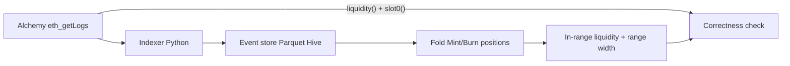

# lp-history-reconstructor

Reconstruct Uniswap **V3** (and V2) pool history from on-chain events
(**event sourcing**), then prove correctness against live contract state.



## What this demonstrates

- **V3 concentrated liquidity**: positions keyed by `(owner, tickLower, tickUpper)` with **range width**
- **NPM wallet attribution**: `tokenId → wallet` via ERC-721 `Transfer`, verified with `positions(tokenId)`
- **Event sourcing**: net liquidity = fold of ordered `Mint`/`Burn` (pool) and `Increase`/`DecreaseLiquidity` (NPM)
- **Measurable data quality**: pool `liquidity()` vs in-range fold; NPM liquidity vs `positions(tokenId)`
- **V2 still supported**: Sync fold + `getReserves()` (toggle `enabled` in `config/pools.yaml`)
- **Chunked `eth_getLogs` backfill** with checkpoints (Alchemy Free = 10-block chunks)

## Quickstart

```bash
uv sync
cp .env.example .env
# LP_ETH_RPC_URL=https://eth-mainnet.g.alchemy.com/v2/<KEY>
make backfill
```

## Default pool (enabled)

Uniswap V3 **USDC/WETH 0.05%** — `0x88e6A0c2dDD26FEEb64F039a2c41296FcB3f5640`

A short lookback will often report `SMOKE_OK PARTIAL` (reconstructed L < on-chain L)
because older Mints sit outside the window. Exact `PASS` needs a longer backfill
(or PAYG Alchemy). The pipeline and position/range math still run end-to-end.

## Repository layout

```
config/          pools + pipeline params
src/lp_history/
  rpc/           JSON-RPC client
  index/         V2 + V3 ABI decode, chunked backfill
  load/          Parquet + checkpoints
  state/         V2 Sync fold + V3 position fold
  verify/        getReserves() / liquidity() checks
tests/           fixtures + mocked RPC
```

## Development

```bash
make lint && make test
```

## Roadmap

- ~~NPM events → wallet-level attribution by range width~~ (done: Transfer + positions())
- Fees / IL / HODL benchmark in dbt + dashboard
- Full backfill from pool deployment + Dagster + live `eth_subscribe`
- ClickHouse on a cheap VM
