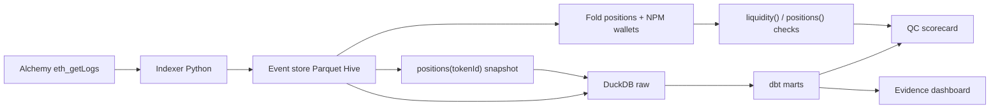

# lp-history-reconstructor

Reconstruct Uniswap **V3** (and V2) pool history from on-chain events
(**event sourcing**), attribute positions to wallets via NPM, **score
reconstruction against live contract calls**, then measure
**fees / IL vs HODL by range width** in dbt. Runnable locally with `uv` or in
**Docker**.

**Live dashboard:** [lp-history-reconstructor on Vercel](https://lp-history-reconstructor.vercel.app/)
(Evidence.dev, refreshed hourly by GitHub Actions onto the `data` branch).
If Vercel asks for a login, disable **Deployment Protection** on the project.

**Dashboard:** Evidence under `dashboard/` — repo-root `vercel.json` builds that folder.
See `dashboard/README.md`.


```mermaid
flowchart LR
    alchemy["Alchemy eth_getLogs"] --> indexer["Indexer Python"]
    indexer --> parquet["Event store Parquet Hive"]
    parquet --> fold["Fold positions + NPM wallets"]
    fold --> verify["liquidity() / positions() checks"]
    verify --> eval["QC scorecard"]
    parquet --> snap["positions(tokenId) snapshot"]
    snap --> duck["DuckDB raw"]
    parquet --> duck
    duck --> dbt["dbt marts"]
    dbt --> evidence["Evidence dashboard"]
    dbt --> eval
```

## Research / QC framing

This repo is the **ground-truth eval** piece of the portfolio: reconstruct state from
an event stream, score it against on-chain truth, and document when metrics are only
directional (lookback / clear-exit caveats).

| Concern | How this repo answers it |
|---|---|
| Realistic task | Event-sourced LP history + NFT wallet attribution |
| Reliable rubric | Exact / PARTIAL / SMOKE_OK vs `getReserves()` / `liquidity()` / `positions()` |
| Controlled comparison | Fees and IL vs HODL by range-width buckets |
| Validation loop | Live verify + mart sanity → `artifacts/qc_scorecard.md` with explicit caveats |
| ML signal | Clear-exit trust classifier for IL/HODL usefulness → `artifacts/ml_pnl_report.md` |

### ML (metric trust)

Lightweight model predicting whether a position is a clear-exit case (IL vs HODL metrics
are more trustworthy). Complements on-chain verify; does not replace ground-truth checks.

```bash
make ml   # → artifacts/ml_pnl_report.md
```

Sibling stories: [crypto-market-elt](https://github.com/marioespinosaperales/crypto-market-elt) (ingestion contracts) and [dex-trades-canonical](https://github.com/marioespinosaperales/dex-trades-canonical) (labeling rubric).

## What this demonstrates

- **Ground-truth QC**: pool `liquidity()` vs in-range fold; NPM liquidity vs `positions(tokenId)`; V2 `getReserves()`
- **Eval scorecard**: exact vs partial/smoke rates, clear-exit coverage, range-bucket counts, lookback caveats
- **ML trust model**: `python -m lp_history.ml` predicts clear-exit so IL/HODL rows are not trusted blindly
- **V3 concentrated liquidity**: positions keyed by `(owner, tickLower, tickUpper)` with **range width**
- **NPM wallet attribution**: `tokenId → wallet` via ERC-721 `Transfer`
- **Event sourcing**: net liquidity = fold of ordered Mint/Burn and Increase/DecreaseLiquidity
- **Fees + IL vs HODL by range width**: dbt marts (narrow / mid / wide / full) with clear-exit gating
- **Docker + Linux pipeline**: chunked `eth_getLogs` backfill with checkpoints

## Quickstart

```bash
uv sync
cp .env.example .env
# LP_ETH_RPC_URL=https://eth-mainnet.g.alchemy.com/v2/<KEY>
make backfill
make transform   # NFT snapshot → DuckDB → dbt
make snapshot    # Evidence DuckDB under dashboard/sources/lp/
make eval        # QC scorecard → artifacts/qc_scorecard.md
make ml          # clear-exit trust model → artifacts/ml_pnl_report.md
```

Offline scorecard (no RPC; demo verify rows + mart sanity if warehouse exists):

```bash
uv run python -m lp_history.evals --offline
```

**Docker:**

```bash
make docker-build
make docker-pipeline   # needs .env with LP_ETH_RPC_URL
make docker-test       # pytest + offline scorecard inside the image
```

PowerShell (no make):

```powershell
uv run python -m lp_history.run
uv run python -m lp_history.build_warehouse
$env:LP_DUCKDB_PATH = "warehouse/lp.duckdb"
uv run dbt build --project-dir dbt --profiles-dir dbt
uv run python -m lp_history.export_snapshot
uv run python -m lp_history.evals
```

Dashboard (local):

```bash
cd dashboard && npm install && npm run sources && npm run dev
```

## Default pool (enabled)

Uniswap V3 **USDC/WETH 0.05%** — `0x88e6A0c2dDD26FEEb64F039a2c41296FcB3f5640`

A lookback of **2500 blocks** (~8–10h) usually captures Collect/Decrease cycles for
fees and PnL-vs-HODL marts. Exact pool `liquidity()` match still needs a longer
backfill (or PAYG Alchemy). Marts are **directional** — Collect may include
principal; `fees_proxy ≈ Collect − Decrease`. The scorecard surfaces these caveats
explicitly rather than hiding a partial verify behind a green check.

## Hourly refresh

GitHub Actions (`.github/workflows/refresh.yml`) runs the pipeline hourly and
force-pushes `dashboard/sources/lp/lp_marts.duckdb` to the `data` branch, then
hits a Vercel deploy hook. Required secrets: `LP_ETH_RPC_URL`,
`VERCEL_DEPLOY_HOOK_URL` (optional: `TELEGRAM_BOT_TOKEN`, `TELEGRAM_CHAT_ID`).

## Repository layout

```
config/          pools + npm + pipeline params
src/lp_history/
  rpc/           JSON-RPC client
  index/         V2 + V3 + NPM ABI decode, chunked backfill
  load/          Parquet + DuckDB loader
  state/         folds (reserves, positions, wallets)
  verify/        on-chain correctness checks
  evals/         QC scorecard (verify summary + mart sanity)
  ml/            clear-exit trust model (IL/HODL usefulness)
  analytics/     price math + NFT snapshot for warehouse joins
dbt/             staging → intermediate → marts (fees / IL vs HODL)
dashboard/       Evidence report over marts snapshot
tests/           fixtures + mocked RPC
Dockerfile       reproducible Linux image (uv + pipeline)
```

## Development

```bash
make lint && make test
make eval
```

## Roadmap

- ~~NPM events → wallet-level attribution by range width~~
- ~~Fees / IL / HODL benchmark in dbt + dashboard~~
- ~~Public Evidence deploy on Vercel~~
- ~~Scheduled snapshot refresh (GitHub Actions + deploy hook)~~
- ~~QC scorecard + Docker~~
- Full backfill from pool deployment + Dagster + live `eth_subscribe`
- ClickHouse on a cheap VM
